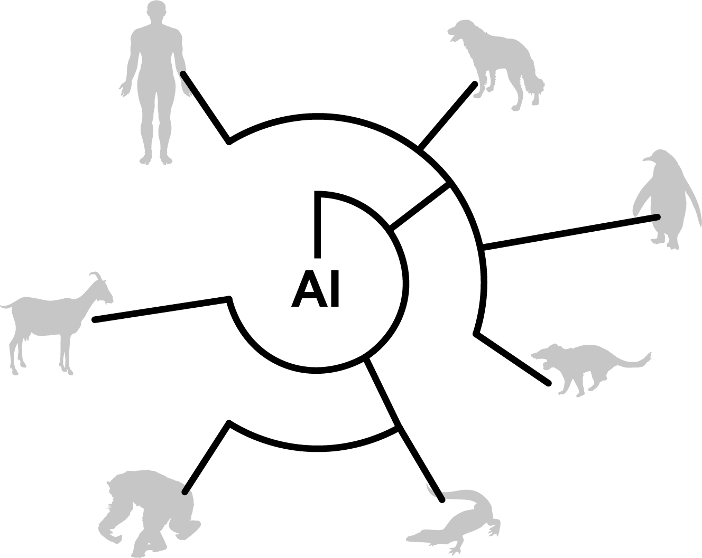

# Pan-species histology

## AI-powered pan-species computational pathology: bridging clinic and wildlife care

Khalid AbdulJabbar, Simon P. Castillo, Katherine Hughes, Hannah Davidson, Amy M. Boddy, Lisa M. Abegglen, Elizabeth P. Murchison, Trevor A. Graham, Simon Spiro, Chiara Palmieri, Yinyin Yuan

Contact [Khalid AbdulJabbar](khalid.abduljabbar@icr.ac.uk), [Simon Castillo](simon.castillo@icr.ac.uk), or [Yinyin Yuan](yinyin.yuan@icr.ac.uk)

### Reproducing paper results

### Analysis of morphospace
Morphospace analysis bundle can be found in the [Morphospace folder](https://github.com/simonpcastillo/PanSpeciesHistology/tree/main/Morphospace). It runs on R with single cell detections that we have provided in [Morphospace/Data](https://github.com/simonpcastillo/PanSpeciesHistology/tree/main/Morphospace/Data).

